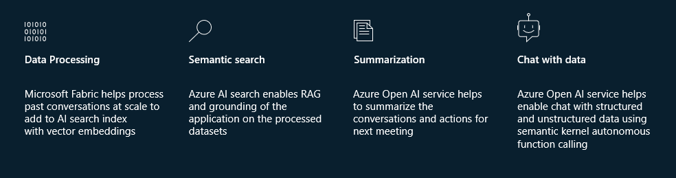
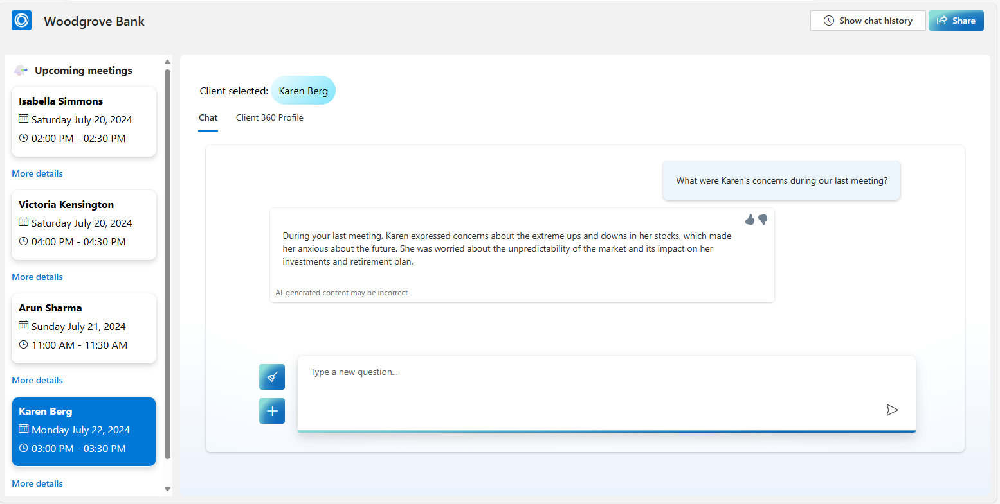
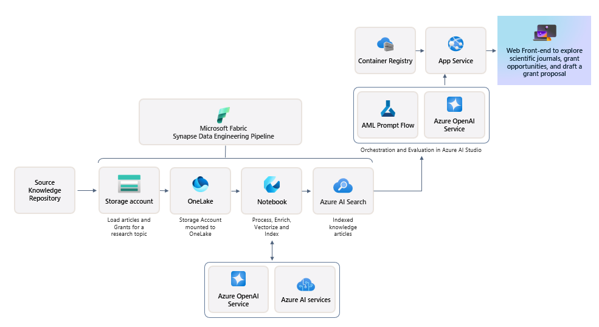

# Build your own copilot Solution Accelerator

MENU: [**USER STORY**](#user-story) \| [**QUICK DEPLOY**](#quick-deploy)  \| [**SUPPORTING DOCUMENTS**](#supporting-documents) \|
[**CUSTOMER TRUTH**](#customer-truth)

<h2>
 
User story
</h2>

**Solution accelerator overview**

This solution accelerator is a powerful tool that helps you create your own copilots. The accelerator can be used by any customer looking for reusable architecture and code snippets to build custom copilots with their own enterprise data. 

It leverages Azure Open AI Service, Azure AI Search and Microsoft Fabric, to streamline daily tasks and customer meeting preparation for customer-facing roles. As a result, this helps to improve client retention and customer satisfaction. By increasing employee productivity and improving customer conversations, our solution enables organizations to serve more customers and drive increased revenue for the entire company. 

 
**Scenario**

A Woodgrove Bank Client Advisor is preparing for upcoming client meetings. He wants insight into his scheduled client meetings, access to portfolio information, a comprehensive understanding of previous meetings, and the ability to ask questions about client’s financial details and interests. 
  
This solution with an integrated copilot helps Client Advisors to save time and prepare relevant discussion topics for scheduled meetings. It provides an overview of daily client meetings with seamless navigation between viewing client profiles and chatting with data. Altogether, these features streamline meeting preparation for client advisors and result in more productive conversations with clients. 

The sample data used in this repository is synthetic and generated using Azure Open AI service. The data is intended for use as sample data only.

 

**Key features**

 

**Below is an image of the solution accelerator.**

<h2>
 
Quick deploy
</h2>

### Prerequisites

To use this solution accelerator, you will need access to an [Azure subscription](https://azure.microsoft.com/free/) with permission to create resource groups and resources. While not required, a prior understanding of Azure Open AI, Azure AI Search and Microsoft Fabric will be helpful.

For additional training and support, please see:

1. [Azure Open AI](https://learn.microsoft.com/en-us/azure/ai-services/openai/) 
2. [Azure AI Search](https://learn.microsoft.com/en-us/azure/search/) 
3. [Azure Functions](https://learn.microsoft.com/en-us/azure/azure-functions/)
4. [Azure App Service](https://learn.microsoft.com/en-us/azure/app-service/)
5. [Azure SQL Database](https://learn.microsoft.com/en-us/azure/azure-sql/)
6. [Microsoft Fabric](https://learn.microsoft.com/en-us/fabric/)

### Solution accelerator architecture

 > Note: Some features contained in this repository are in private preview. Certain features might not be supported or might have constrained capabilities. For more information, see [Supplemental Terms of Use for Microsoft Azure Previews](https://azure.microsoft.com/en-us/support/legal/preview-supplemental-terms).

### **How to install/deploy**

1. Please check the link [Azure Products by Region](
https://azure.microsoft.com/en-us/explore/global-infrastructure/products-by-region/?products=all&regions=all) and choose a region where Azure AI Search, Semantic Ranker, Azure OpenAI Service, and Azure AI Studio are available. 

2. Click the following deployment button to create the required resources for this accelerator in your Azure Subscription.

   

3. You will need to select an Azure Subscription, create/select a Resource group, Region, a unique Solution Prefix and an Azure location for Cosmos DB.

   

4. When deployment is complete, Follow steps in [Fabric Deployment guide](./Deployment/FabricDeployment.md) to set up the data processing pipelines and Power BI report in Fabric.

5. Optionally, follow steps in [Teams Tab App guide](./Deployment/TeamsAppDeployment.md) to add the Client Advisor app to Microsoft Teams.

 
 
<h2>
 
Supporting documents
</h2>

Supporting documents coming soon.

 
<h2>
 
Customer truth
</h2>
Customer stories coming soon.

 

<h2>
 
Responsible AI Transparency FAQ 
</h2>

Please refer to [Transarency FAQ](../TRANSPARENCY_FAQ.md) for responsible AI transparency details of this solution accelerator.

 
 
---

## Disclaimers

This release is an artificial intelligence (AI) system that generates text based on user input. The text generated by this system may include ungrounded content, meaning that it is not verified by any reliable source or based on any factual data. The data included in this release is synthetic, meaning that it is artificially created by the system and may contain factual errors or inconsistencies. Users of this release are responsible for determining the accuracy, validity, and suitability of any content generated by the system for their intended purposes. Users should not rely on the system output as a source of truth or as a substitute for human judgment or expertise. 

This release only supports English language input and output. Users should not attempt to use the system with any other language or format. The system output may not be compatible with any translation tools or services, and may lose its meaning or coherence if translated. 

This release does not reflect the opinions, views, or values of Microsoft Corporation or any of its affiliates, subsidiaries, or partners. The system output is solely based on the system's own logic and algorithms, and does not represent any endorsement, recommendation, or advice from Microsoft or any other entity. Microsoft disclaims any liability or responsibility for any damages, losses, or harms arising from the use of this release or its output by any user or third party. 

This release does not provide any financial advice, and is not designed to replace the role of qualified client advisors in appropriately advising clients. Users should not use the system output for any financial decisions or transactions, and should consult with a professional financial advisor before taking any action based on the system output. Microsoft is not a financial institution or a fiduciary, and does not offer any financial products or services through this release or its output. 

This release is intended as a proof of concept only, and is not a finished or polished product. It is not intended for commercial use or distribution, and is subject to change or discontinuation without notice. Any planned deployment of this release or its output should include comprehensive testing and evaluation to ensure it is fit for purpose and meets the user's requirements and expectations. Microsoft does not guarantee the quality, performance, reliability, or availability of this release or its output, and does not provide any warranty or support for it. 

This Software requires the use of third-party components which are governed by separate proprietary or open-source licenses as identified below, and you must comply with the terms of each applicable license in order to use the Software. You acknowledge and agree that this license does not grant you a license or other right to use any such third-party proprietary or open-source components.  

To the extent that the Software includes components or code used in or derived from Microsoft products or services, including without limitation Microsoft Azure Services (collectively, “Microsoft Products and Services”), you must also comply with the Product Terms applicable to such Microsoft Products and Services. You acknowledge and agree that the license governing the Software does not grant you a license or other right to use Microsoft Products and Services. Nothing in the license or this ReadMe file will serve to supersede, amend, terminate or modify any terms in the Product Terms for any Microsoft Products and Services. 

You must also comply with all domestic and international export laws and regulations that apply to the Software, which include restrictions on destinations, end users, and end use. For further information on export restrictions, visit https://aka.ms/exporting. 

You acknowledge that the Software and Microsoft Products and Services (1) are not designed, intended or made available as a medical device(s), and (2) are not designed or intended to be a substitute for professional medical advice, diagnosis, treatment, or judgment and should not be used to replace or as a substitute for professional medical advice, diagnosis, treatment, or judgment. Customer is solely responsible for displaying and/or obtaining appropriate consents, warnings, disclaimers, and acknowledgements to end users of Customer’s implementation of the Online Services. 

You acknowledge the Software is not subject to SOC 1 and SOC 2 compliance audits. No Microsoft technology, nor any of its component technologies, including the Software, is intended or made available as a substitute for the professional advice, opinion, or judgement of a certified financial services professional. Do not use the Software to replace, substitute, or provide professional financial advice or judgment.  

BY ACCESSING OR USING THE SOFTWARE, YOU ACKNOWLEDGE THAT THE SOFTWARE IS NOT DESIGNED OR INTENDED TO SUPPORT ANY USE IN WHICH A SERVICE INTERRUPTION, DEFECT, ERROR, OR OTHER FAILURE OF THE SOFTWARE COULD RESULT IN THE DEATH OR SERIOUS BODILY INJURY OF ANY PERSON OR IN PHYSICAL OR ENVIRONMENTAL DAMAGE (COLLECTIVELY, “HIGH-RISK USE”), AND THAT YOU WILL ENSURE THAT, IN THE EVENT OF ANY INTERRUPTION, DEFECT, ERROR, OR OTHER FAILURE OF THE SOFTWARE, THE SAFETY OF PEOPLE, PROPERTY, AND THE ENVIRONMENT ARE NOT REDUCED BELOW A LEVEL THAT IS REASONABLY, APPROPRIATE, AND LEGAL, WHETHER IN GENERAL OR IN A SPECIFIC INDUSTRY. BY ACCESSING THE SOFTWARE, YOU FURTHER ACKNOWLEDGE THAT YOUR HIGH-RISK USE OF THE SOFTWARE IS AT YOUR OWN RISK.  