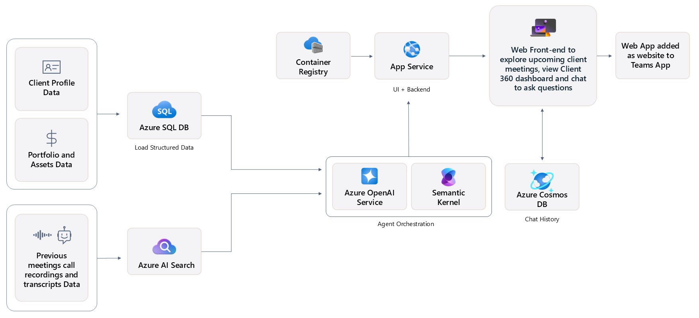

# {🟨TODO: Accelerator name} solution accelerator

This solution accelerator is a powerful tool that helps you create your own copilots. The accelerator can be used by any customer looking for reusable architecture and code snippets to build custom copilots with their own enterprise data.

 

  
[**SOLUTION OVERVIEW**](#solution-overview)  \| [**QUICK DEPLOY**](#quick-deploy)  \| [**BUSINESS USE CASE**](#business-use-case)  \| [**SUPPORTING DOCUMENTATION**](#supporting-documentation)

 

<h2>
Solution overview
</h2>

Leverages Azure OpenAI Service and Azure AI Search, this solution streamlines daily tasks and customer meeting preparation for customer-facing roles. As a result, this helps to improve client retention and customer satisfaction. By increasing employee productivity and improving customer conversations, our solution enables organizations to serve more customers and drive increased revenue for the entire company.

### Solution architecture
||
|---|

### How to customize
If you'd like to customize the solution accelerator, here are some common areas to start:

[Azd deployment parameters](./docs/CustomizingAzdParameters.md)

[Fabric integration deployment](./docs/FabricDeployment.md)

[Teams integration deployment](./docs/TeamsAppDeployment.md)

 

### Additional resources

[Getting started with sample questions](./docs/SampleQuestions.md)

[Version History & Researcher Use Case](#version-history)
 

 

### Key features

  
Click to learn more about the key features this solution enables

  - **Data processing**  
  Process past conversations at scale to add to AI search index with vector embeddings.​
  
  - **Semantic search**  
  Azure AI Search enabled RAG and grounding of the application on the processed datasets.​

  - **Seummarization**  
  Azure OpenAI Service helps to summarize the conversations and actions for the next meeting.​

  - **Chat with data**  
  Azure OpenAI Service helpsenable chat with structured and unstructured data using Semantic Kernel autonomous function calling.​
     

  
<h2>
Quick deploy
</h2>

### How to install or deploy
Follow the quick deploy steps on the deployment guide to deploy this solution to your own Azure subscription.

[Click here to launch the deployment guide](./docs/DeploymentGuide.md)
  

|  |  | 
|---|---|

 

> ⚠️ **Important: Check Azure OpenAI Quota Availability**
  To ensure sufficient quota is available in your subscription, please follow [quota check instructions guide](./docs/QuotaCheck.md) before you deploy the solution.

 

### Prerequisites and Costs

To deploy this solution accelerator, ensure you have access to an [Azure subscription](https://azure.microsoft.com/free/) with the necessary permissions to create **resource groups, resources, app registrations, and assign roles at the resource group level**. This should include Contributor role at the subscription level and  Role Based Access Control role on the subscription and/or resource group level. Follow the steps in [Azure Account Set Up](./docs/AzureAccountSetUp.md).

Here are some example regions where the services are available: East US, East US2, Australia East, UK South, France Central.

Check the [Azure Products by Region](https://azure.microsoft.com/en-us/explore/global-infrastructure/products-by-region/?products=all&regions=all) page and select a **region** where the following services are available.

Pricing varies per region and usage, so it isn't possible to predict exact costs for your usage. The majority of the Azure resources used in this infrastructure are on usage-based pricing tiers. However, Azure Container Registry has a fixed cost per registry per day.

{🟨TODO: Update with solution specific estimate sheet}

Use the [Azure pricing calculator](https://azure.microsoft.com/en-us/pricing/calculator) to calculate the cost of this solution in your subscription. 

Review a [sample pricing sheet](https://azure.com/e/68b51f4cb79a4466b631a11aa57e9c16) in the event you want to customize and scale usage.

_Note: This is not meant to outline all costs as selected SKUs, scaled use, customizations, and integrations into your own tenant can affect the total consumption of this sample solution. The sample pricing sheet is meant to give you a starting point to customize the estimate for your specific needs._

 

{🟨TODO: Update with all products, decription of product use, and product specific pricing links}

| Product | Description | Cost |
|---|---|---|
| [Product Name with Link to Learn content](https://learn.microsoft.com) | Decription of how the product is used | [Pricing]() |
| [Product Name with Link to Learn content](https://learn.microsoft.com) | Decription of how the product is used | [Pricing]() |
| [Product Name with Link to Learn content](https://learn.microsoft.com) | Decription of how the product is used | [Pricing]() |
| [Product Name with Link to Learn content](https://learn.microsoft.com) | Decription of how the product is used | [Pricing]() |

 

>⚠️ **Important:** To avoid unnecessary costs, remember to take down your app if it's no longer in use,
either by deleting the resource group in the Portal or running `azd down`.

  
<h2>
Business Use Case
</h2>

{🟨TODO: Update with solution specific image}
||
|---|

 

{🟨TODO: Fill in with overview of the use case as represented in the solution}

Lorem ipsum dolor sit amet, consectetur adipiscing elit. Aliquam viverra et dolor rutrum vestibulum. Vestibulum non porta dolor, eu vulputate lacus. 

In tempus nibh vel lectus vestibulum, eget suscipit turpis auctor. Nam egestas ante vel mi tempor, ac suscipit elit tempor. Aliquam eget hendrerit lacus. Nullam euismod eget tortor congue interdum. Vestibulum laoreet, tellus laoreet consequat facilisis, quam purus tincidunt tellus, non maximus dolor lacus a risus. Aliquam erat volutpat. 

Nulla sit amet mollis magna. Sed pellentesque vestibulum ante non vestibulum. In congue interdum dolor, et blandit nisi consectetur quis. Pellentesque habitant morbi tristique senectus et netus et malesuada fames ac turpis egestas.

Nulla pretium malesuada purus, vel euismod urna ultrices eu. Nullam enim neque, suscipit quis hendrerit iaculis, iaculis a metus. 

⚠️ The sample data used in this repository is synthetic and generated using Azure OpenAI service. The data is intended for use as sample data only.

{🟨TODO: Fill in with business value}
### Business value

  
Click to learn more about what value this solution provides

  - **Business value name**  
  Business value description goes here.

  - **Business value name**  
  Business value description goes here.

  - **Business value name**  
  Business value description goes here.

  - **Business value name**  
  Business value description goes here.

     

  

<h2>
Supporting documentation
</h2>

### Security guidelines

{🟨TODO: Fill in with solution specific security guidelines similar to the below}

This template uses Azure Key Vault to store all connections to communicate between resources.

This template also uses [Managed Identity](https://learn.microsoft.com/entra/identity/managed-identities-azure-resources/overview) for local development and deployment.

To ensure continued best practices in your own repository, we recommend that anyone creating solutions based on our templates ensure that the [Github secret scanning](https://docs.github.com/code-security/secret-scanning/about-secret-scanning) setting is enabled.

You may want to consider additional security measures, such as:

* Enabling Microsoft Defender for Cloud to [secure your Azure resources](https://learn.microsoft.com/azure/security-center/defender-for-cloud).
* Protecting the Azure Container Apps instance with a [firewall](https://learn.microsoft.com/azure/container-apps/waf-app-gateway) and/or [Virtual Network](https://learn.microsoft.com/azure/container-apps/networking?tabs=workload-profiles-env%2Cazure-cli).

 

### Cross references
Check out similar solution accelerators
 
{🟨TODO: Identify related accelerators - fill in the name and a one sentence description. The name should have non-breaking spaces in them to make sure the layout doesn't break.}

| Solution Accelerator | Description |
|---|---|
| [Document&nbsp;knowledge&nbsp;mining](https://github.com/microsoft/Document-Knowledge-Mining-Solution-Accelerator) | Provides REST API access to OpenAI's powerful language models including o3-mini, o1, o1-mini, GPT-4o, GPT-4o mini |
| [Conversation&nbsp;knowledge&nbsp;mining](https://github.com/microsoft/Conversation-Knowledge-Mining-Solution-Accelerator) | Description of solution accelerator |
| [Document&nbsp;generation](https://github.com/microsoft/document-generation-solution-accelerator) | Analyzes various media content—such as audio, video, text, and images—transforming it into structured, searchable data |

    

### Version history

An updated version of the **Build Your Own Copilot** solution accelerator was published on **[04/24/2025]**. If you deployed the accelerator prior to that date, please note the following changes:

- The **Research Assistant** project has been moved to a separate branch. You can access it here: [**Research Assistant Branch**](https://github.com/microsoft/Build-your-own-copilot-Solution-Accelerator/tree/byoc-researcher).
- This repository now focuses exclusively on the **Client Advisor** solution scenario.
- The previous folder structure containing both `research-assistant/` and `client-advisor/` directories has been removed.
- The **Client Advisor** solution accelerator is now featured directly on the main landing page, with no additional folders associated.

 

## Provide feedback

{🟨TODO: Update link to create new issues for this repo}

Have questions, find a bug, or want to request a feature? [Submit a new issue](https://github.com/microsoft/content-processing-solution-acclerator/issues) on this repo and we'll connect.

 

## Responsible AI Transparency FAQ 
Please refer to [Transparency FAQ](./TRANSPARENCY_FAQ.md) for responsible AI transparency details of this solution accelerator.

 

## Disclaimers

This release is an artificial intelligence (AI) system that generates text based on user input. The text generated by this system may include ungrounded content, meaning that it is not verified by any reliable source or based on any factual data. The data included in this release is synthetic, meaning that it is artificially created by the system and may contain factual errors or inconsistencies. Users of this release are responsible for determining the accuracy, validity, and suitability of any content generated by the system for their intended purposes. Users should not rely on the system output as a source of truth or as a substitute for human judgment or expertise. 

This release only supports English language input and output. Users should not attempt to use the system with any other language or format. The system output may not be compatible with any translation tools or services, and may lose its meaning or coherence if translated. 

This release does not reflect the opinions, views, or values of Microsoft Corporation or any of its affiliates, subsidiaries, or partners. The system output is solely based on the system's own logic and algorithms, and does not represent any endorsement, recommendation, or advice from Microsoft or any other entity. Microsoft disclaims any liability or responsibility for any damages, losses, or harms arising from the use of this release or its output by any user or third party. 

This release does not provide any financial advice, and is not designed to replace the role of qualified client advisors in appropriately advising clients. Users should not use the system output for any financial decisions or transactions, and should consult with a professional financial advisor before taking any action based on the system output. Microsoft is not a financial institution or a fiduciary, and does not offer any financial products or services through this release or its output. 

This release is intended as a proof of concept only, and is not a finished or polished product. It is not intended for commercial use or distribution, and is subject to change or discontinuation without notice. Any planned deployment of this release or its output should include comprehensive testing and evaluation to ensure it is fit for purpose and meets the user's requirements and expectations. Microsoft does not guarantee the quality, performance, reliability, or availability of this release or its output, and does not provide any warranty or support for it. 

This Software requires the use of third-party components which are governed by separate proprietary or open-source licenses as identified below, and you must comply with the terms of each applicable license in order to use the Software. You acknowledge and agree that this license does not grant you a license or other right to use any such third-party proprietary or open-source components.  

To the extent that the Software includes components or code used in or derived from Microsoft products or services, including without limitation Microsoft Azure Services (collectively, “Microsoft Products and Services”), you must also comply with the Product Terms applicable to such Microsoft Products and Services. You acknowledge and agree that the license governing the Software does not grant you a license or other right to use Microsoft Products and Services. Nothing in the license or this ReadMe file will serve to supersede, amend, terminate or modify any terms in the Product Terms for any Microsoft Products and Services. 

You must also comply with all domestic and international export laws and regulations that apply to the Software, which include restrictions on destinations, end users, and end use. For further information on export restrictions, visit https://aka.ms/exporting. 

You acknowledge that the Software and Microsoft Products and Services (1) are not designed, intended or made available as a medical device(s), and (2) are not designed or intended to be a substitute for professional medical advice, diagnosis, treatment, or judgment and should not be used to replace or as a substitute for professional medical advice, diagnosis, treatment, or judgment. Customer is solely responsible for displaying and/or obtaining appropriate consents, warnings, disclaimers, and acknowledgements to end users of Customer’s implementation of the Online Services. 

You acknowledge the Software is not subject to SOC 1 and SOC 2 compliance audits. No Microsoft technology, nor any of its component technologies, including the Software, is intended or made available as a substitute for the professional advice, opinion, or judgement of a certified financial services professional. Do not use the Software to replace, substitute, or provide professional financial advice or judgment.  

BY ACCESSING OR USING THE SOFTWARE, YOU ACKNOWLEDGE THAT THE SOFTWARE IS NOT DESIGNED OR INTENDED TO SUPPORT ANY USE IN WHICH A SERVICE INTERRUPTION, DEFECT, ERROR, OR OTHER FAILURE OF THE SOFTWARE COULD RESULT IN THE DEATH OR SERIOUS BODILY INJURY OF ANY PERSON OR IN PHYSICAL OR ENVIRONMENTAL DAMAGE (COLLECTIVELY, “HIGH-RISK USE”), AND THAT YOU WILL ENSURE THAT, IN THE EVENT OF ANY INTERRUPTION, DEFECT, ERROR, OR OTHER FAILURE OF THE SOFTWARE, THE SAFETY OF PEOPLE, PROPERTY, AND THE ENVIRONMENT ARE NOT REDUCED BELOW A LEVEL THAT IS REASONABLY, APPROPRIATE, AND LEGAL, WHETHER IN GENERAL OR IN A SPECIFIC INDUSTRY. BY ACCESSING THE SOFTWARE, YOU FURTHER ACKNOWLEDGE THAT YOUR HIGH-RISK USE OF THE SOFTWARE IS AT YOUR OWN RISK.