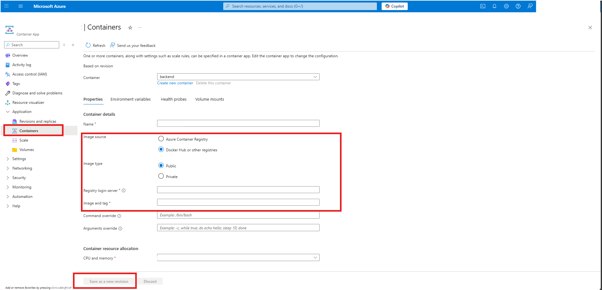
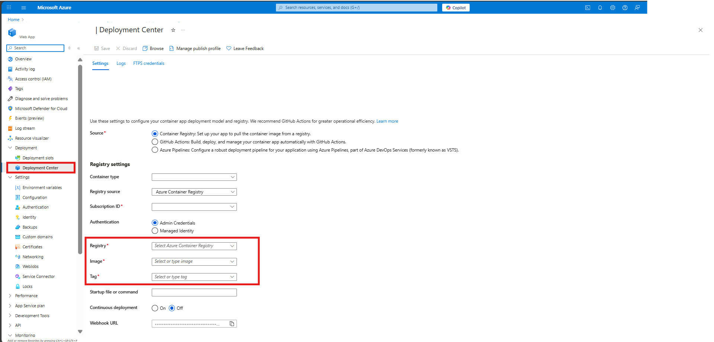

# Azure Container Registry (ACR) – Build & Push Guide

This guide provides step-by-step instructions to build and push Docker images for **WebApp** and **Backend** services into Azure Container Registry (ACR).

## 📋 Prerequisites
Before starting, ensure you have:
- An active [Azure Subscription](https://portal.azure.com/)
- [Azure CLI](https://learn.microsoft.com/en-us/cli/azure/install-azure-cli) installed and logged in
- [Docker Desktop](https://docs.docker.com/get-docker/) installed and running
- Access to your Azure Container Registry (ACR)
- To create an Azure Container Registry (ACR), you can refer to the following guides:

    - [Create Container Registry using Azure CLI](https://learn.microsoft.com/en-us/azure/container-registry/container-registry-get-started-azure-cli)

    - [Create Container Registry using Azure Portal](https://learn.microsoft.com/en-us/azure/container-registry/container-registry-get-started-portal?tabs=azure-cli)

    - [Create Container Registry using PowerShell](https://learn.microsoft.com/en-us/azure/container-registry/container-registry-get-started-powershell)

    - [Create Container Registry using ARM Template](https://learn.microsoft.com/en-us/azure/container-registry/container-registry-get-started-geo-replication-template)

    - [Create Container Registry using Bicep](https://learn.microsoft.com/en-us/azure/container-registry/container-registry-get-started-bicep?tabs=CLI)

---

Login to ACR :
``` bash
az acr login --name $ACR_NAME
```

## 🚀 Build and Push Images

**Backend :** 
 
 ```bash 
az acr login --name <containerregname>
docker build --no-cache -f docker/Backend.Dockerfile -t <acrloginserver>/<repo>:<tagname> .
docker push <acrloginserver>/<repo>:<tagname>
 ```

 If you want to update image tag and image manually you can follow below steps:
- Go to your **Container App** in the [Azure Portal](https://portal.azure.com/#home).
- In the left menu, select **Containers**.
- Under your container, update:

    - Image source → Azure Container Registry / Docker Hub.

    - Image name → myapp/backend.

    - Tag → change to the new one you pushed (e.g., v2).

- Click **Save** → this will create a new revision automatically with the updated image.



**WebApp :**

```bash
az acr login --name <containerregname>
docker build --no-cache -f docker/Frontend.Dockerfile -t <acrloginserver>/<repo>:<tagname> .
docker push <acrloginserver>/<repo>:<tagname>
```

If you want to update image tag and image manually you can follow below steps:
- Go to your App Service in the [Azure Portal](https://portal.azure.com/#home).
- In the left menu, select Deployment → Deployment Center
- Under Container settings, you can configure:

    - Image Source → (e.g., Azure Container Registry / Docker Hub / Other).

    - Image Name → e.g., myapp/backend.

    - Tag → e.g., v1.2.3.




## ✅ Verification

Run the following command to verify that images were pushed successfully:
```bash
az acr repository list --name $ACR_NAME --output table
```

You should see repositories in the output.

## 📝 Notes

- Always use meaningful tags (v1.0.0, staging, prod) instead of just latest.

- If you are pushing from a CI/CD pipeline, make sure the pipeline agent has access to Docker and ACR.

- For private images, ensure your services (e.g., Azure Container Apps, AKS, App Service) are configured with appropriate ACR pull permissions.


