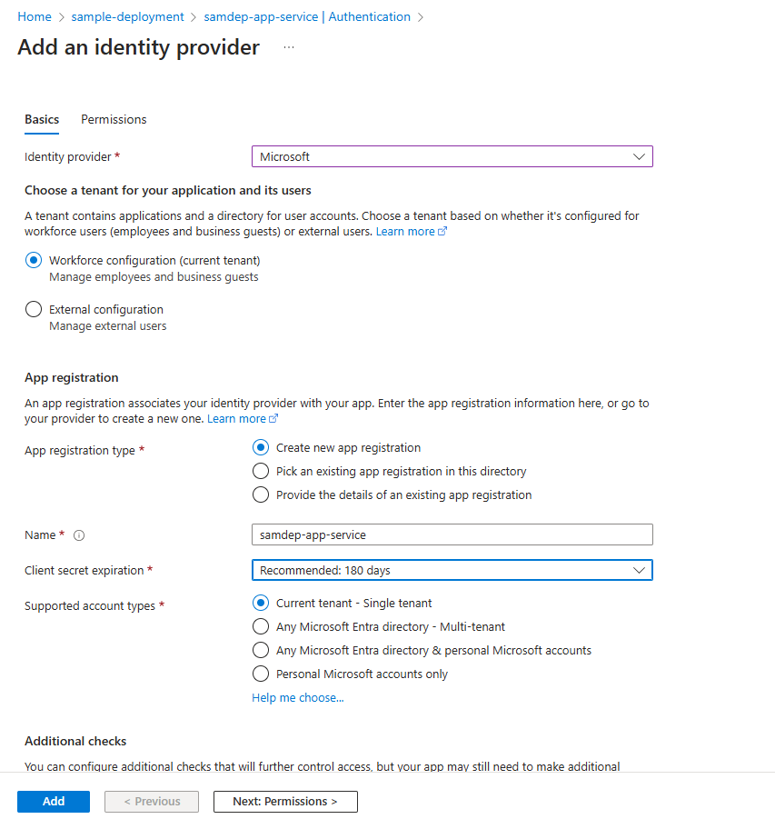

# Set up Authentication in Azure Container App

This document provides step-by-step instructions to configure Azure App Registrations for a front-end application.

## Prerequisites

- Access to **Microsoft Entra ID**
- Necessary permissions to create and manage **App Registrations**

## Add Authentication in Azure App Service configuration

1. Click on `Authentication` from left menu.

  

1. Click on `+ Add identity provider` to see a list of identity providers.

  

1. Click on `+ Add Provider` to see a list of identity providers.

  

1. Select the first option `Microsoft Entra Id` from the drop-down list.
 

1. Accept the default values and click on `Add` button to go back to the previous page with the identify provider added.