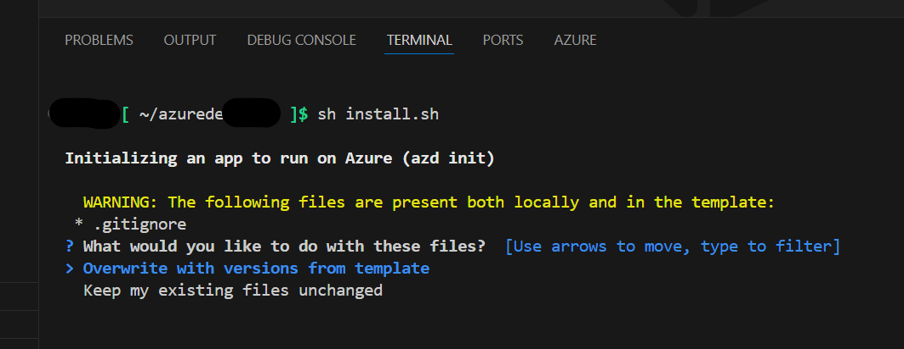

# Deployment Guide

## Overview

This guide walks you through deploying the Build Your Own Copilot Solution Accelerator to Azure. The deployment process takes approximately 7-10 minutes for the default Development/Testing configuration and includes both infrastructure provisioning and application setup.

🆘 **Need Help?** If you encounter any issues during deployment, check our [Troubleshooting Guide](TroubleShootingSteps.md) for solutions to common problems.

---

## Step 1: Prerequisites & Setup

### 1.1 Azure Account Requirements

Ensure you have access to an [Azure subscription](https://azure.microsoft.com/free/) with the following permissions:

| **Permission/Role** | **Scope** | **Purpose** |
|---------------------|-----------|-------------|
| Contributor | Subscription level | Create and manage Azure resources |
| User Access Administrator | Subscription level | Manage user access and role assignments |
| Role Based Access Control | Subscription/Resource Group level | Configure RBAC permissions |
| App Registration Creation | Microsoft Entra ID | Create and configure authentication |

🔍 **How to Check Your Permissions:**

1. Go to [Azure Portal](https://portal.azure.com/)
2. Navigate to **Subscriptions** (search for "subscriptions" in the top search bar)
3. Click on your target subscription
4. In the left menu, click **Access control (IAM)**
5. Scroll down to see the table with your assigned roles - you should see:
   - Contributor
   - User Access Administrator
   - Role Based Access Control Administrator (or similar RBAC role)

**For App Registration permissions:**

1. Go to **Microsoft Entra ID** → **Manage** → **App registrations**
2. Try clicking **New registration**
3. If you can access this page, you have the required permissions
4. Cancel without creating an app registration

📖 **Detailed Setup:** Follow [Azure Account Set Up](AzureAccountSetUp.md) for complete configuration.

### 1.2 Check Service Availability & Quota

⚠️ **CRITICAL:** Before proceeding, ensure your chosen region has all required services available:

**Required Azure Services:**

- [Azure AI Foundry](https://learn.microsoft.com/en-us/azure/ai-foundry/)
- [Azure OpenAI Service](https://learn.microsoft.com/en-us/azure/ai-services/openai/)
- [Azure AI Search](https://learn.microsoft.com/en-us/azure/search/)
- [Azure App Service](https://learn.microsoft.com/en-us/azure/app-service/)
- [Azure SQL Database](https://learn.microsoft.com/en-us/azure/azure-sql/)
- [Azure Cosmos DB](https://learn.microsoft.com/en-us/azure/cosmos-db/)
- [Azure Blob Storage](https://learn.microsoft.com/en-us/azure/storage/blobs/)
- [Azure Semantic Search](AzureSemanticSearchRegion.md)

**Recommended Regions:** East US, East US2, Australia East, UK South, France Central

🔍 **Check Availability:** Use [Azure Products by Region](https://azure.microsoft.com/en-us/explore/global-infrastructure/products-by-region/table) to verify service availability.

### 1.3 Quota Check (Optional)

💡 **RECOMMENDED:** Check your Azure OpenAI quota availability before deployment for optimal planning.

**Recommended Configuration:**

- **Default:** 30k tokens (minimum)
- **Optimal:** 150k tokens (recommended for best performance)

> **Note:** When you run `azd up`, the deployment will automatically show you regions with available quota, so this pre-check is optional but helpful for planning purposes. You can customize these settings later in Step 3.3: Advanced Configuration.

📖 **Adjust Quota:** Follow [Azure GPT Quota Settings](AzureGPTQuotaSettings.md) if needed.

---

## Step 2: Choose Your Deployment Environment

Select one of the following options to deploy the Build Your Own Copilot Solution Accelerator:

### Environment Comparison

| **Environment** | **Best For** | **Requirements** | **Setup Time** |
|-----------------|--------------|------------------|----------------|
| GitHub Codespaces | Quick deployment, no local setup required | GitHub account | ~3-5 minutes |
| VS Code Dev Containers | Fast deployment with local tools | Docker Desktop, VS Code | ~5-10 minutes |
| VS Code Web | Quick deployment, no local setup required | Azure account | ~2-4 minutes |
| Local Environment | Enterprise environments, full control | All tools individually | ~15-30 minutes |

💡 **Recommendation:** For fastest deployment, start with **GitHub Codespaces** - no local installation required.

<details>
  <summary><b>Option A: GitHub Codespaces (Easiest)</b></summary>

[](https://github.com/codespaces/new?repo=microsoft/Build-your-own-copilot-Solution-Accelerator)

1. Click the badge above (may take several minutes to load)
2. Accept default values on the Codespaces creation page
3. Wait for the environment to initialize (includes all deployment tools)
4. Proceed to [Step 3: Configure Deployment Settings](#step-3-configure-deployment-settings)

</details>

<details>
  <summary><b>Option B: VS Code Dev Containers</b></summary>

[](https://vscode.dev/redirect?url=vscode://ms-vscode-remote.remote-containers/cloneInVolume?url=https://github.com/microsoft/Build-your-own-copilot-Solution-Accelerator)

**Prerequisites:**

- [Docker Desktop](https://www.docker.com/products/docker-desktop/) installed and running
- [VS Code](https://code.visualstudio.com/) with [Dev Containers extension](https://marketplace.visualstudio.com/items?itemName=ms-vscode-remote.remote-containers)

**Steps:**

1. Start Docker Desktop
2. Click the badge above to open in Dev Containers
3. Wait for the container to build and start (includes all deployment tools)
4. Proceed to [Step 3: Configure Deployment Settings](#step-3-configure-deployment-settings)

</details>

<details>
  <summary><b>Option C: Visual Studio Code Web</b></summary>

[&message=Open&color=blue&logo=visualstudiocode&logoColor=white)](https://insiders.vscode.dev/azure/?vscode-azure-exp=foundry&agentPayload=eyJiYXNlVXJsIjogImh0dHBzOi8vcmF3LmdpdGh1YnVzZXJjb250ZW50LmNvbS9taWNyb3NvZnQvQnVpbGQteW91ci1vd24tY29waWxvdC1Tb2x1dGlvbi1BY2NlbGVyYXRvci9yZWZzL2hlYWRzL21haW4vaW5mcmEvdnNjb2RlX3dlYiIsICJpbmRleFVybCI6ICIvaW5kZXguanNvbiIsICJ2YXJpYWJsZXMiOiB7ImFnZW50SWQiOiAiIiwgImNvbm5lY3Rpb25TdHJpbmciOiAiIiwgInRocmVhZElkIjogIiIsICJ1c2VyTWVzc2FnZSI6ICIiLCAicGxheWdyb3VuZE5hbWUiOiAiIiwgImxvY2F0aW9uIjogIiIsICJzdWJzY3JpcHRpb25JZCI6ICIiLCAicmVzb3VyY2VJZCI6ICIiLCAicHJvamVjdFJlc291cmNlSWQiOiAiIiwgImVuZHBvaW50IjogIiJ9LCAiY29kZVJvdXRlIjogWyJhaS1wcm9qZWN0cy1zZGsiLCAicHl0aG9uIiwgImRlZmF1bHQtYXp1cmUtYXV0aCIsICJlbmRwb2ludCJdfQ==)

1. Click the badge above to open in VS Code Web
2. Sign in with your Microsoft account linked to your Azure subscription
3. Select the appropriate subscription to continue
4. Wait for the environment to initialize (includes all deployment tools)
5. When prompted in the VS Code Web terminal, choose one of the available options shown below:
  
6. Proceed to [Step 3: Configure Deployment Settings](#step-3-configure-deployment-settings)

</details>

<details>
  <summary><b>Option D: Local Environment</b></summary>

**Prerequisites:**

Ensure the following tools are installed:

- [PowerShell](https://learn.microsoft.com/en-us/powershell/scripting/install/installing-powershell?view=powershell-7.5) (v7.0+) - available for Windows, macOS, and Linux
- [Azure Developer CLI (azd)](https://aka.ms/install-azd) (v1.18.0+)
- [Python 3.9 to 3.11](https://www.python.org/downloads/)
- [Docker Desktop](https://www.docker.com/products/docker-desktop/)
- [Git](https://git-scm.com/downloads)
- [Microsoft ODBC Driver 18 for SQL Server](https://learn.microsoft.com/en-us/sql/connect/odbc/download-odbc-driver-for-sql-server?view=sql-server-ver16)

**Steps:**

1. Clone the repository:
   ```shell
   azd init -t microsoft/build-your-own-copilot-solution-accelerator/
   ```
2. Open the project folder in your terminal or editor
3. Proceed to [Step 3: Configure Deployment Settings](#step-3-configure-deployment-settings)

</details>

---

## Step 3: Configure Deployment Settings

💡 **Before You Start:** Review the configuration options below. You can customize any settings that meet your needs, or leave them as defaults to proceed with a standard deployment.

### 3.1 Choose Deployment Type (Optional)

| **Configuration** | **Development/Testing (Default)** | **Production (WAF-Aligned)** |
|-------------------|-----------------------------------|------------------------------|
| Configuration File | `main.parameters.json` (sandbox) | Copy `main.waf.parameters.json` to `main.parameters.json` |
| Security Controls | Minimal (for rapid iteration) | Enhanced (production best practices) |
| Cost | Lower costs | Cost optimized |
| Use Case | POCs, development, testing | Production workloads |
| Framework | Basic configuration | Well-Architected Framework |
| Features | Core functionality | Reliability, security, operational excellence |

**To use production configuration:**

Copy the contents from the production configuration file to your main parameters file:

1. Navigate to the `infra` folder in your project
2. Open `main.waf.parameters.json` in a text editor (like Notepad, VS Code, etc.)
3. Select all content (Ctrl+A) and copy it (Ctrl+C)
4. Open `main.parameters.json` in the same text editor
5. Select all existing content (Ctrl+A) and paste the copied content (Ctrl+V)
6. Save the file (Ctrl+S)

> **Note:** The WAF-aligned configuration is under active development. More Azure Well-Architected recommendations will be added in future updates.

### 3.2 Set VM Credentials (Optional - Production Deployment Only)

> **Note:** This section only applies if you selected Production deployment type in section 3.1. VMs are not deployed in the default Development/Testing configuration.

By default, random GUIDs are generated for VM credentials. To set custom credentials:

```shell
azd env set AZURE_ENV_VM_ADMIN_USERNAME <your-username>
azd env set AZURE_ENV_VM_ADMIN_PASSWORD <your-password>
```

### 3.3 Advanced Configuration (Optional)

<details>
  <summary><b>Configurable Parameters</b></summary>

When you start the deployment, most parameters will have **default values**, but you can update these settings by following the steps [here](CustomizingAzdParameters.md).

</details>

<details>
  <summary><b>Reuse Existing Resources</b></summary>

**Reusing an Existing Log Analytics Workspace:**

Guide to get your [Existing Workspace ID](re-use-log-analytics.md)

**Reusing an Existing Azure AI Foundry Project:**

Guide to get your [Existing Project ID](re-use-foundry-project.md)

</details>

---

## Step 4: Deploy the Solution

💡 **Before You Start:** If you encounter any issues during deployment, check our [Troubleshooting Guide](TroubleShootingSteps.md) for common solutions.

### 4.1 Authenticate with Azure

```shell
azd auth login
```

**For specific tenants:**

```shell
azd auth login --tenant-id <tenant-id>
```

> **Finding Tenant ID:**
>
> 1. Open the [Azure Portal](https://portal.azure.com/)
> 2. Navigate to **Microsoft Entra ID** from the left-hand menu
> 3. Under the **Overview** section, locate the **Tenant ID** field and copy the value displayed

### 4.2 Start Deployment

```shell
azd up
```

> **Note:** This solution accelerator requires **Azure Developer CLI (azd) version 1.18.0 or higher**. Please ensure you have the latest version installed before proceeding with deployment. [Download azd here](https://learn.microsoft.com/en-us/azure/developer/azure-developer-cli/install-azd).

**During deployment, you'll be prompted for:**

1. **Environment name** (e.g., "byocaapp") - Must be 3-16 characters long, alphanumeric only
2. **Azure subscription** selection
3. **Azure location** - Select a region where all required services are available with sufficient quota

**Expected Duration:** 7-10 minutes for default configuration

⚠️ **Deployment Issues:** If you encounter errors or timeouts, try a different region as there may be capacity constraints. For detailed error solutions, see our [Troubleshooting Guide](TroubleShootingSteps.md).

### 4.3 Get Application URL

After successful deployment:

1. Open [Azure Portal](https://portal.azure.com/)
2. Navigate to your resource group
3. Find the **App Service** and get the app URL from **Default domain**

⚠️ **Important:** Complete Post-Deployment Steps before accessing the application.

---

## Step 5: Post-Deployment Configuration

### 5.1 Import Sample Data (Required)

**Choose the appropriate command based on your deployment method:**

**If you deployed using `azd up` command:**

```bash 
bash ./infra/scripts/process_sample_data.sh 
```

> **Note:** The script will automatically take required values from your `azd` environment.

**If you deployed using custom templates, ARM/Bicep deployments, or `az deployment group` commands:**

```bash 
bash ./infra/scripts/process_sample_data.sh <your-resource-group-name>
```

> **Note:** Replace `<your-resource-group-name>` with the actual name of the resource group containing your deployed Azure resources.

💡 **Tip:** If the deployment metadata does not exist in Azure or has been deleted, the script will prompt you to manually enter the required configuration values.

### 5.2 Configure Authentication (Required)

This step is mandatory for application access:

1. Follow [App Authentication Configuration](AppAuthentication.md)
2. Wait up to 10 minutes for authentication changes to take effect

### 5.3 Verify Deployment

1. Access your application using the URL from Step 4.3
2. Confirm the application loads successfully
3. Verify you can sign in with your authenticated account

### 5.4 Test the Application

Test the app with sample questions to verify functionality:

- **Sample Question:** _"Show latest asset value by asset type?"_

📖 **More Examples:** For additional sample questions you can test in the application, see [Sample Questions](SampleQuestions.md).

---

## Step 6: Clean Up (Optional)

### Remove All Resources

```shell
azd down
```

> **Note:** If you deployed with `enableRedundancy=true` and Log Analytics workspace replication is enabled, you must first disable replication before running `azd down`, else resource group delete will fail. Follow the steps in [Handling Log Analytics Workspace Deletion with Replication Enabled](LogAnalyticsReplicationDisable.md), wait until replication returns `false`, then run `azd down`.

### Manual Cleanup (if needed)

If deployment fails or you need to clean up manually:

- Follow [Delete Resource Group Guide](DeleteResourceGroup.md)

---

## Managing Multiple Environments

### Recover from Failed Deployment

If your deployment failed or encountered errors, here are the steps to recover:

<details>
  <summary><b>Recover from Failed Deployment</b></summary>

1. Clean up the failed deployment:
   ```shell
   azd down
   ```

2. Start a new deployment:
   ```shell
   azd up
   ```

</details>

### Creating a New Environment

If you need to deploy to a different region, test different configurations, or create additional environments:

<details>
  <summary><b>Create a New Environment</b></summary>

1. Create a new environment:
   ```shell
   azd env new <environment-name>
   ```

2. Deploy to the new environment:
   ```shell
   azd up
   ```

</details>

### Switch Between Environments

<details>
  <summary><b>Switch Between Environments</b></summary>

To switch between existing environments:

```shell
azd env select <environment-name>
```

</details>

### Best Practices for Multiple Environments

- **Use descriptive names:** `byocdev`, `byocprod`, `byoctest` (remember: 3-16 chars, alphanumeric only)
- **Different regions:** Deploy to multiple regions for testing quota availability
- **Separate configurations:** Each environment can have different parameter settings
- **Clean up unused environments:** Use `azd down` to remove environments you no longer need

---

## Next Steps

Now that your deployment is complete and tested, explore these resources to enhance your experience:

📚 **Learn More:**

- [Sample Questions](SampleQuestions.md) - Try example queries with the application
- [Troubleshooting Guide](TroubleShootingSteps.md) - Solutions to common issues
- [Customize AZD Parameters](CustomizingAzdParameters.md) - Tailor deployment parameters
- [Azure GPT Quota Settings](AzureGPTQuotaSettings.md) - Adjust model quotas
- [Local Development Setup](LocalSetupAndDeploy.md) - Set up your local development environment


## Need Help?

- 🐛 **Issues:** Check [Troubleshooting Guide](TroubleShootingSteps.md)
- 💬 **Support:** Review [Support Guidelines](../SUPPORT.md)
- 🔧 **Development:** See [Contributing Guide](../CONTRIBUTING.md)
- 🔒 **Security:** Read [Security Policy](../SECURITY.md)
- 📋 **Transparency:** View [Transparency FAQ](../TRANSPARENCY_FAQ.md)

---

## Advanced: Deploy Local Changes

If you've made local modifications to the code and want to deploy them to Azure, follow these steps to swap the configuration files:

> **Note:** To set up and run the application locally for development, see the [Local Development Setup Guide](LocalSetupAndDeploy.md).

### Step 1: Rename Azure Configuration Files

In the root directory:

1. Rename `azure.yaml` to `azure_custom2.yaml`
2. Rename `azure_custom.yaml` to `azure.yaml`

### Step 2: Rename Infrastructure Files

In the `infra` directory:

1. Rename `main.bicep` to `main_custom2.bicep`
2. Rename `main_custom.bicep` to `main.bicep`

### Step 3: Deploy Changes

Run the deployment command:

```shell
azd up
```

> **Note:** These custom files are configured to deploy your local code changes instead of pulling from the GitHub repository.

---

## Publishing Local Build Container to Azure Container Registry

If you need to rebuild the source code and push the updated container to the deployed Azure Container Registry, follow these steps:

1. Set the environment variable `USE_LOCAL_BUILD` to `True`:

   - **Linux/macOS:**
     ```bash
     export USE_LOCAL_BUILD=True
     ```

   - **Windows (PowerShell):**
     ```powershell
     $env:USE_LOCAL_BUILD = $true
     ```

2. Run the `az login` command:
   ```bash
   az login
   ```

3. Run the `azd up` command again to rebuild and push the updated container:
   ```bash
   azd up
   ```

This will rebuild the source code, package it into a container, and push it to the Azure Container Registry associated with your deployment.

---

## Environment Configuration for Local Development & Debugging

> Set `APP_ENV` in your `.env` file to control Azure authentication. Set the environment variable to `dev` to use Azure CLI credentials, or to `prod` to use Managed Identity for production. **Ensure you're logged in via `az login` when using `dev` in local.**

To configure your environment, follow these steps:

1. Navigate to the `src\App` folder
2. Create a `.env` file based on the `.env.sample` file
3. Fill in the `.env` file using the deployment output or by retrieving values from the Azure Portal under "Deployments" in your resource group
4. Ensure that the `APP_ENV` variable is set to "**dev**"
