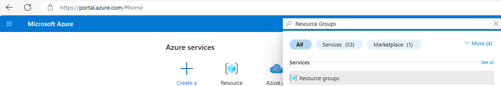
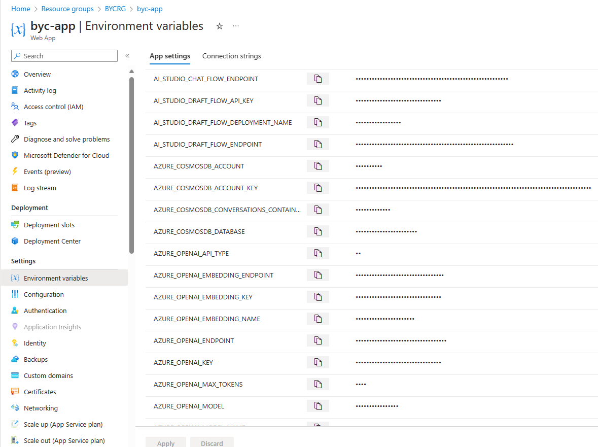
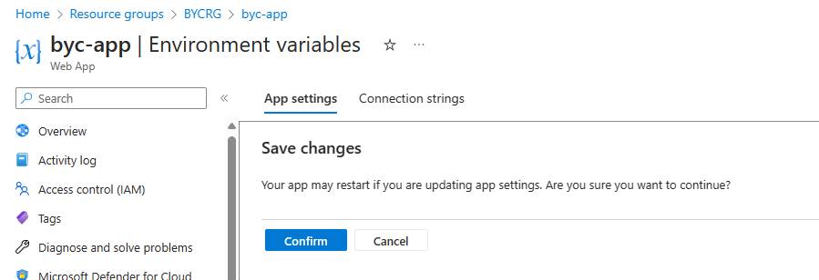
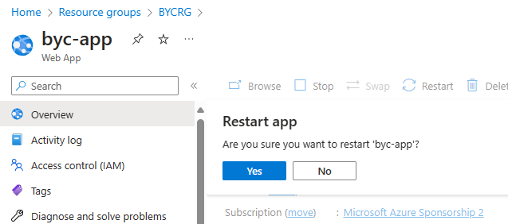
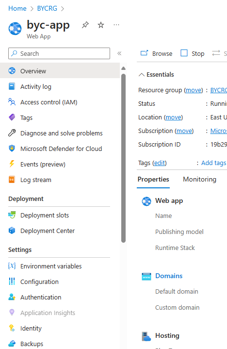
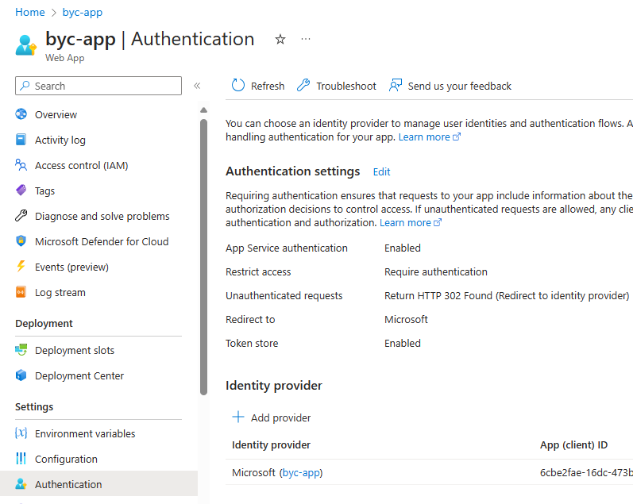
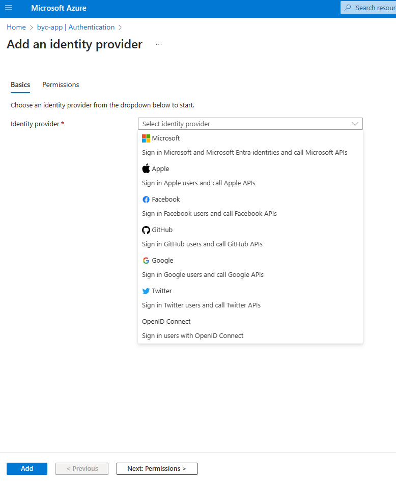
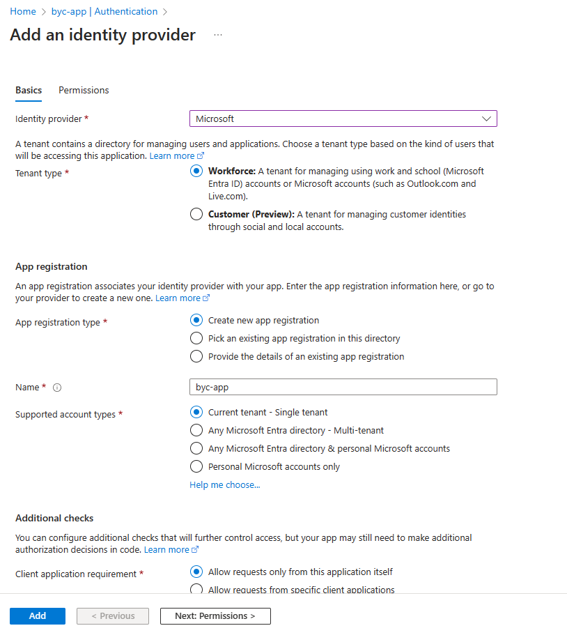
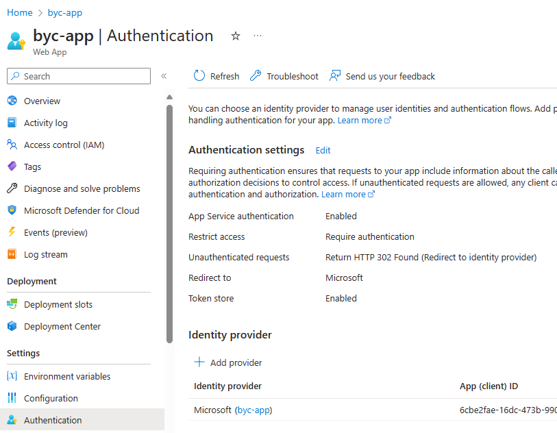

## Fabric Deployment
## Step 1: Create Fabric workspace
1.  Navigate to ([Fabric Workspace](https://app.fabric.microsoft.com/))
2.  Click on Workspaces from left Navigation
3.  Click on + New Workspace
      - Provide Name of Workspace 
      - Provide Description of Workspace (optional)
      - Click Apply
4.  Open Workspace
5.  Retrieve Workspace ID from URL, refer to documentation additional assistance ([here](https://learn.microsoft.com/en-us/fabric/admin/portal-workspace#identify-your-workspace-id))

## Step 2: Deploy Fabric resources and artifacts
1.   Navigate to ([Azure Portal](https://portal.azure.com/))
2.   Click on Azure Cloud Shell in the top right of navigation Menu (add image)
3.   Run the run the following commands:  
      - ```az login``` 
      - ```rm -rf Build-your-own-copilot-Solution-Accelerator```
      - ```git clone https://github.com/microsoft/Build-your-own-copilot-Solution-Accelerator```
      - ```cd ./Build-your-own-copilot-Solution-Accelerator/ClientAdvisor/Deployment/scripts/fabric_scripts```
      - ```sh ./run_fabric_items_scripts.sh keyvault_param workspaceid_param solutionprefix_param```  
         1. keyvault_param - the name of the keyvault that was created in Step 1
         2. workspaceid_param - the workspaceid created in Step 2
         3. solutionprefix_param - prefix used to append to lakehouse upon creation
4.  Get Fabric Lakehouse connection details:
5.  Once deployment is complete, navigate to Fabric Workspace
6.   Find Lakehouse in workspace (ex.lakehouse_*solutionprefix_param*)
7.   Click on the ```...``` next to the SQL Analytics Endpoint
8.   Click on ```Copy SQL connection string```
9.   Click Copy button in popup window.
10.  Wait 5 minutes to allow the data pipelines to finish processing then proceed to next step.
## Step 3: **Open Power BI report**
1.   Download the .pbix file from the [Reports folder](../PowerBIReport/).
2.   Open Power BI report in Power BI Dashboard
3.   Click on `Transform Data` menu option from the Task Bar
4.   Click `Data source settings`
5.   Click `Change Source...`
6.   Input the Server link (from Fabric Workspace)
7.   Input Database name (the lakehouse name from Fabric Workspace)
8.   Click `OK`
9.   Click `Edit Permissions`
10.  If not signed in, sign in your credentials and proceed to click OK
11.  Click `Close`
12.  Report should refresh with new connection.

## Step 4: **Publish Power BI**
1.  Click `Publish` (from PBI report in Power BI Desktop application)
2.  Select Fabric Workspace
3.  Click `Select`
4.  After publish is complete, navigate to Fabric Workspace
5.  Click `...` next to the Semantic model for Power BI report
6.  Click on `Settings` 
7.  Click on `Edit credentials` (under Data source credentials)
8.  Select `OAuth2` for the Authentication method
9.  Select option for `Privacy level setting for this data source`
10. Click `Sign in`
11. Navigate back to Fabric workspace and click on Power BI report.
12. Click on `File` -> `Embed Report` -> `Website or Portal` from the top menu.
13. Copy the first line from the popup with title `Here's a link you can use to embed this content.` for use later in step 5.6.

## Step 5: Update the Power BI URL in Azure App Service configuration
1. Launch the Azure Portal [Azure Portal](https://portal.azure.com/).
2. Enter `Resource Groups` in the top search bar.

    

3. Locate your Resource Group you selected/created during one-click deployment and click on it.

4. Locate the App Service in the Resource Group and click on it.

5. Click on `Environment Variables` from left menu under `Settings`.

    

6. Modify the below variables with the value collected in step 4.13 above.
- VITE_POWERBI_EMBED_URL

7. Click on `Apply` button at the bottom of the screen. Then click on `Confirm` in the pop-up.

    

8. Click on `Overview` from the left menu. Then click on `Restart` button in the top menu. Then click on `Yes` in the pop-up message. 

   

    
## Step 6: Add Authentication in Azure App Service configuration

1. Click on `Authentication` from left menu.

  

2. Click on `+ Add Provider` to see a list of identity providers.

  

3. Click on `+ Add Provider` to see a list of identity providers.

  

4. Select the first option `Microsoft Entra Id` from the drop-down list.
 

5. Accept the default values and click on `Add` button to go back to the previous page with the identify provider added.
 
