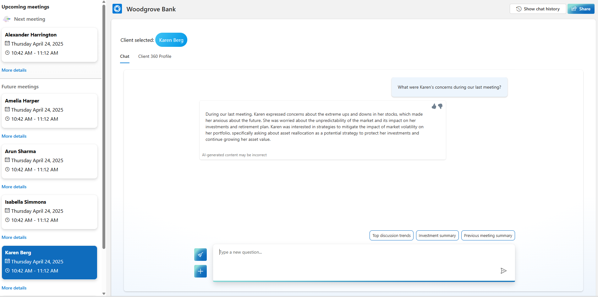

# Sample Questions

To help you get started, here are some **Sample Prompts** you can ask after selecting the **Karen Berg** client:

1. Click on **Karen Berg** client.
2. Ask the following questions:
   - What were Karen's concerns during our last meeting?
   - Did karen express any concerns over market fluctuations in prior meetings?
   - What type of asset does karen own ?
   - Show latest asset value by asset type?
   - How did equities asset value change in the last six months?

  

_This structured approach helps users quickly retrieve client-specific insights, track financial trends, and stay informed on client priorities for better decision-making and engagement._
