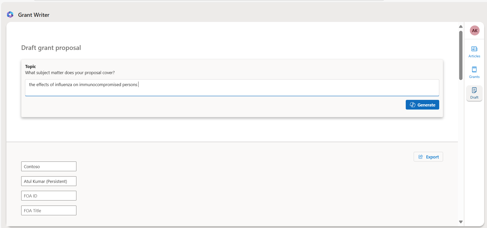

# Sample Questions

To help you get started, here are some **Sample Prompts** you can ask in the app:

## **Sections**

### **Articles**
The Articles section allows users to explore and retrieve information from published research.

_Sample Questions:_

- What are the effects of influenza vaccine on immunocompromised populations?
- How do co-morbidities such as hypertension and obesity affect vaccine effectiveness?

### **Grants**
The Grants section enables users to discover funding opportunities and ongoing research grants related to studies.

_Sample Questions:_

- Are there any grants that focus on clinical research concerning influenza vaccination?
- Tell about Assessment of immunogenicity in relevant influenza animal models.

### **Drafts**
The Drafts section allows users to generate and refine grant proposal drafts with customizable content.

_Sample Operations:_

- Task: Enter the topic name **the effects of influenza on immunocompromised persons** in the **Topic** field and click the **Generate** button

- Task: In **Project narrative** section customize Generate text and click **Re-generate** button
   > text: consolidate summary into a single paragraph".

The application helps users quickly find and summarize articles and grant information, generate and refine grant proposals, and efficiently export the results.
