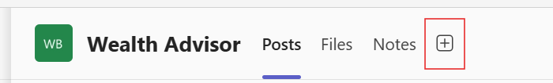
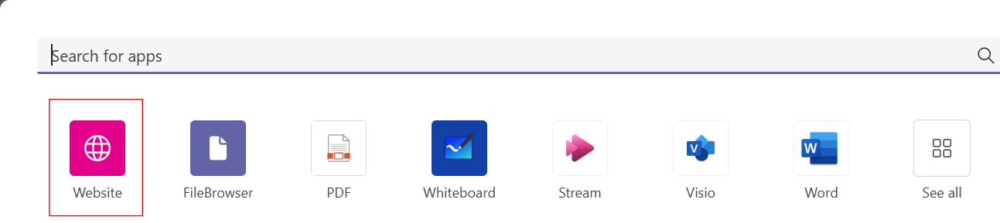
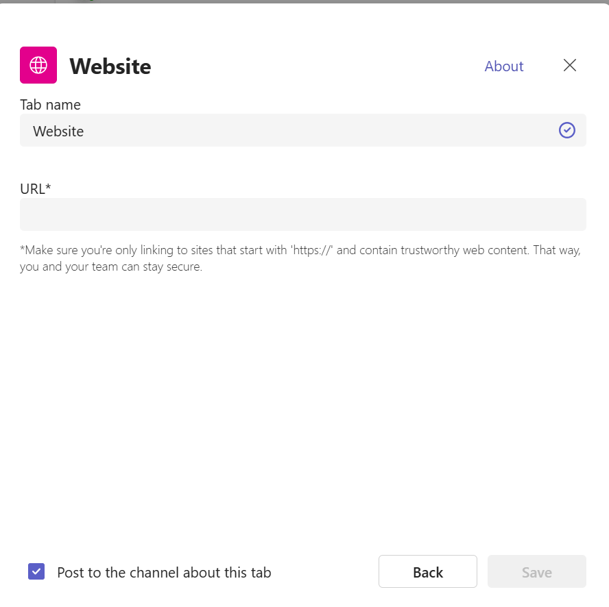

## Teams App Deployment
##### Add Website to Teams App
1. Navigate to the channel where you want to add the website.
2. Click on the Add a tab (+) button.

3. Click on website

4. Enter the tab name and URL in the dialog and then hit save. Make sure that you are using the https:// protocol in your URL.
