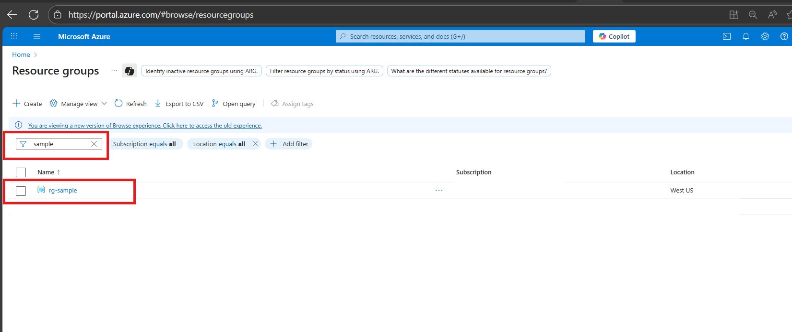

# 🛠️ Troubleshooting
  When deploying Azure resources, you may come across different error codes that stop or delay the deployment process. This section lists some of the most common errors along with possible causes and step-by-step resolutions.

Use these as quick reference guides to unblock your deployments.

## Error Codes

 <details>
<summary><b>ReadOnlyDisabledSubscription</b></summary>  
 
- Check if you have an active subscription before starting the deployment.
 
</details>

 <details>
  <summary><b>MissingSubscriptionRegistration/ AllowBringYourOwnPublicIpAddress/ InvalidAuthenticationToken</b></summary>
 
 
Enable `AllowBringYourOwnPublicIpAddress` Feature
 
Before deploying the resources, you may need to enable the **Bring Your Own Public IP Address** feature in Azure. This is required only once per subscription.
 
### Steps
 
1. **Run the following command to register the feature:**
 
   ```bash
   az feature register --namespace Microsoft.Network --name AllowBringYourOwnPublicIpAddress
   ```
 
2. **Wait for the registration to complete.**
    You can check the status using:
 
    ```bash
    az feature show --namespace Microsoft.Network --name AllowBringYourOwnPublicIpAddress --query properties.state
    ```
 
3. **The output should show:**
    "Registered"
 
4. **Once the feature is registered, refresh the provider:**
 
    ```bash
    az provider register --namespace Microsoft.Network
    ```
 
    💡 Note: Feature registration may take several minutes to complete. This needs to be done only once per Azure subscription.
 
  </details>
 
<details>
<summary><b>ResourceGroupNotFound</b></summary>
 
## Option 1
### Steps
 
1. Go to [Azure Portal](https://portal.azure.com/#home).
 
2. Click on the **"Resource groups"** option available on the Azure portal home page.


3. In the Resource Groups search bar, search for the resource group you intend to target for deployment. If it exists, you can proceed with using it.


 ## Option 2
 
- This error can occur if you deploy the template using the same .env file - from a previous deployment.
- To avoid this issue, create a new environment before redeploying.
- You can use the following command to create a new environment:
 ```bash
 azd env new <env-name>
 ```
</details>
<details>
<summary><b>ResourceGroupBeingDeleted</b></summary>
 
To prevent this issue, please ensure that the resource group you are targeting for deployment is not currently being deleted. You can follow steps to verify resource group is being deleted or not.
### Steps:
1. Go to [Azure Portal](https://portal.azure.com/#home)
2. Go to resource group option and search for targeted resource group
3. If Targeted resource group is there and deletion for this is in progress, it means you cannot use this, you can create new or use any other resource group
 
</details>
 
<details>
<summary><b>InternalSubscriptionIsOverQuotaForSku/ManagedEnvironmentProvisioningError </b></summary>

Quotas are applied per resource group, subscriptions, accounts, and other scopes. For example, your subscription might be configured to limit the number of vCPUs for a region. If you attempt to deploy a virtual machine with more vCPUs than the permitted amount, you receive an error that the quota was exceeded. 
For PowerShell, use the `Get-AzVMUsage` cmdlet to find virtual machine quotas.
```ps
Get-AzVMUsage -Location "West US"
```
based on available quota you can deploy application otherwise, you can request for more quota
</details>
 
<details>
<summary><b>InsufficientQuota</b></summary>

- Check if you have sufficient quota available in your subscription before deployment.
- To verify, refer to the [quota_check](../docs/QuotaCheck.md) file for details.

</details>
 
<details>
<summary><b>DeploymentModelNotSupported/ ServiceModelDeprecated/ InvalidResourceProperties</b></summary>
 
 -  The updated model may not be supported in the selected region. Please verify its availability in the [Azure AI Foundry models](https://learn.microsoft.com/en-us/azure/ai-foundry/openai/concepts/models?tabs=global-standard%2Cstandard-chat-completions) document.
 
</details>
 <details>
<summary><b>LinkedInvalidPropertyId/ ResourceNotFound/DeploymentOutputEvaluationFailed/ CanNotRestoreANonExistingResource / The language expression property array index is out of bounds</b></summary>
  
- Before using any resource ID, ensure it follows the correct format.
- Verify that the resource ID you are passing actually exists.
- Make sure there are no typos in the resource ID.
- Verify that the provisioning state of the existing resource is `Succeeded` by running the following command to avoid this error while deployment or restoring the resource.

    ```bash
    az resource show --ids <Resource ID> --query "properties.provisioningState"
    ```
- Sample Resource IDs format
    - Log Analytics Workspace Resource ID
    ```
    /subscriptions/{subscriptionId}/resourceGroups/{resourceGroupName}/providers/Microsoft.OperationalInsights/workspaces/{workspaceName}
    ```
    - Azure AI Foundry Project Resource ID
    ```
    /subscriptions/{subscriptionId}/resourceGroups/{resourceGroupName}/providers/Microsoft.MachineLearningServices/workspaces/{name}
    ```
- You may encounter the error `The language expression property array index '8' is out of bounds` if the resource ID is incomplete. Please ensure your resource ID is correct and contains all required information, as shown in sample resource IDs.

- For more information refer [Resource Not Found errors solutions](https://learn.microsoft.com/en-us/azure/azure-resource-manager/troubleshooting/error-not-found?tabs=bicep)

</details>
 <details>
<summary><b>ResourceNameInvalid</b></summary>
 
- Ensure the resource name is within the allowed length and naming rules defined for that specific resource type, you can refer [Resource Naming Convention](https://learn.microsoft.com/en-us/azure/azure-resource-manager/management/resource-name-rules) document.

</details>
 <details>
<summary><b>ServiceUnavailable/ResourceNotFound</b></summary>
 
  - Regions are restricted to guarantee compatibility with paired regions and replica locations for data redundancy and failover scenarios based on articles [Azure regions list](https://learn.microsoft.com/en-us/azure/reliability/regions-list) and [Azure Database for MySQL Flexible Server - Azure Regions](https://learn.microsoft.com/azure/mysql/flexible-server/overview#azure-regions).

  - You can request more quota, refer [Quota Request](https://learn.microsoft.com/en-us/azure/cosmos-db/nosql/create-support-request-quota-increase) Documentation


</details>
 <details>
<summary><b>Workspace Name - InvalidParameter</b></summary>

 To avoid this errors in workspace ID follow below rules. 
1. Must start and end with an alphanumeric character (letter or number).
2. Allowed characters:
    `a–z`
    `0–9`
    `- (hyphen)`
3. Cannot start or end with a hyphen -.
4. No spaces, underscores (_), periods (.), or special characters.
5. Must be unique within the Azure region & subscription.
6. Length: 3–33 characters (for AML workspaces).
</details>
 <details>
<summary><b>BadRequest: Dns record under zone Document is already taken</b></summary>

This error can occur only when user hardcoding the CosmosDB Service name. To avoid this you can try few below suggestions.
- Verify resource names are globally unique.
- If you already created an account/resource with same name in another subscription or resource group, check and delete it before reusing the name.
- By default in this template we are using unique prefix with every resource/account name to avoid this kind for errors.
</details>
 <details>
<summary><b>NetcfgSubnetRangeOutsideVnet</b></summary>

- Ensure the subnet’s IP address range falls within the virtual network’s address space.
- Always validate that the subnet CIDR block is a subset of the VNet range.
- For Azure Bastion, the AzureBastionSubnet must be at least /27.
- Confirm that the AzureBastionSubnet is deployed inside the VNet.
</details>
 <details>
<summary><b>DisableExport_PublicNetworkAccessMustBeDisabled</b></summary>

- <b>Check container source:</b> Confirm whether the deployment is using a Docker image or Azure Container Registry (ACR).
- <b>Verify ACR configuration:</b> If ACR is included, review its settings to ensure they comply with Azure requirements.
- <b>Check export settings:</b> If export is disabled in ACR, make sure public network access is also disabled.
- <b>Dedeploy after fix:</b> Correct the configuration and redeploy. This will prevent the Conflict error during deployment.
- For more information refer [ACR Data Loss Prevention](https://learn.microsoft.com/en-us/azure/container-registry/data-loss-prevention) document. 
</details>
 <details>
<summary><b>AccountProvisioningStateInvalid</b></summary>

- The AccountProvisioningStateInvalid error occurs when you try to use resources while they are still in the Accepted provisioning state.
- This means the deployment has not yet fully completed.
- To avoid this error, wait until the provisioning state changes to Succeeded.
- Only use the resources once the deployment is fully completed.
</details>
 <details>
<summary><b>VaultNameNotValid</b></summary>

 In this template Vault name will be unique everytime, but if you trying to hard code the name then please make sure below points.
 1. Check name length
    - Ensure the Key Vault name is between 3 and 24 characters.
 2. Validate allowed characters
    - The name can only contain letters (a–z, A–Z) and numbers (0–9).
    - Hyphens are allowed, but not at the beginning or end, and not consecutive (--).
3. Ensure proper start and end
    - The name must start with a letter.
    - The name must end with a letter or digit (not a hyphen).
4. Test with a new name
    - Example of a valid vault name:
        ✅ `cartersaikeyvault1`
        ✅ `securevaultdemo`
        ✅ `kv-project123`
</details>
 <details>
<summary><b>DeploymentCanceled</b></summary>

 There might be multiple reasons for this error you can follow below steps to troubleshoot.
 1. Check deployment history
    - Go to Azure Portal → Resource Group → Deployments.
    - Look at the detailed error message for the deployment that was canceled — this will show which resource failed and why.
 2. Identify the root cause
    - A DeploymentCanceled usually means:
        - A dependent resource failed to deploy.
        - A validation error occurred earlier.
        - A manual cancellation was triggered.
    - Expand the failed deployment logs for inner error messages.
3. Validate your template (ARM/Bicep)
    Run:
    ```
    az deployment group validate --resource-group <rg-name> --template-file main.bicep
    ```
4. Check resource limits/quotas
    - Ensure you have not exceeded quotas (vCPUs, IPs, storage accounts, etc.), which can silently cause cancellation.
5. Fix the failed dependency
    - If a specific resource shows BadRequest, Conflict, or ValidationError, resolve that first.
    - Re-run the deployment after fixing the root cause.
6. Retry deployment
    Once corrected, redeploy with:
    ```
    az deployment group create --resource-group <rg-name> --template-file main.bicep
    ```
Essentially: DeploymentCanceled itself is just a wrapper error — you need to check inner errors in the deployment logs to find the actual failure.
</details>
<details>
<summary><b>LocationNotAvailableForResourceType</b></summary>
 
- You may encounter a LocationNotAvailableForResourceType error if you set the secondary location to 'Australia Central' in the main.bicep file.
- This happens because 'Australia Central' is not a supported region for that resource type.
- Always refer to the README file or Azure documentation to check the list of supported regions.
- Update the deployment with a valid supported region to resolve the issue.
 
</details>
 
<details>
<summary><b>InvalidResourceLocation</b></summary>  
 
- You may encounter an InvalidResourceLocation error if you change the region for Cosmos DB or the Storage Account (secondary location) multiple times in the main.bicep file and redeploy.
- Azure resources like Cosmos DB and Storage Accounts do not support changing regions after deployment.
- If you need to change the region again, first delete the existing deployment.
- Then redeploy the resources with the updated region configuration.
 
</details>
 
<details>
 
<summary><b>DeploymentActive</b></summary>

- This issue occurs when a deployment is already in progress and another deployment is triggered in the same resource group, causing a DeploymentActive error.
- Cancel the ongoing deployment before starting a new one.
- Do not initiate a new deployment in the same resource group until the previous one is completed.
</details>

<details>
<summary><b>ResourceOperationFailure/ProvisioningDisabled</b></summary>
 
  - This error occurs when provisioning of a resource is restricted in the selected region.
    It usually happens because the service is not available in that region or provisioning has been temporarily disabled.  
 
  - Regions are restricted to guarantee compatibility with paired regions and replica locations for data redundancy and failover scenarios based on articles [Azure regions list](https://learn.microsoft.com/en-us/azure/reliability/regions-list) and [Azure Database for MySQL Flexible Server - Azure Regions](https://learn.microsoft.com/azure/mysql/flexible-server/overview#azure-regions).
   
- If you need to use the same region, you can request a quota or provisioning exception.  
  Refer [Quota Request](https://docs.microsoft.com/en-us/azure/sql-database/quota-increase-request) for more details.
 
</details>

<details>
<summary><b>MaxNumberOfRegionalEnvironmentsInSubExceeded</b></summary>

- This error occurs when you try to create more than the allowed number of **Azure Container App Environments (ACA Environments)** in the same region for a subscription.  
- For example, in **Sweden Central**, only **1 Container App Environment** is allowed per subscription.  

The subscription 'xxxx-xxxx' cannot have more than 1 Container App Environments in Sweden Central.

- To fix this, you can:
  - Deploy the Container App Environment in a **different region**, OR  
  - Request a quota increase via Azure Support → [Quota Increase Request](https://go.microsoft.com/fwlink/?linkid=2208872)  

</details>

<details>
<summary><b>Unauthorized - Operation cannot be completed without additional quota</b> </summary>
 
- You can check your quota usage using `az vm list-usage`.
   
    ```
    az vm list-usage --location "<Location>" -o table
    ```
- To Request more quota refer [VM Quota Request](https://techcommunity.microsoft.com/blog/startupsatmicrosoftblog/how-to-increase-quota-for-specific-types-of-azure-virtual-machines/3792394).
 
</details>
 
<details><summary><b>ParentResourceNotFound</b>

</summary>
 
- You can refer to the [Parent Resource Not found](https://learn.microsoft.com/en-us/azure/azure-resource-manager/troubleshooting/error-parent-resource?tabs=bicep) documentation if you encounter this error.
 
</details>
 
<details><summary><b>ResourceProviderError</b></summary>

- This error occurs when the resource provider is not registered in your subscription. 
- To register it, refer to [Register Resource Provider](https://learn.microsoft.com/en-us/azure/azure-resource-manager/troubleshooting/error-register-resource-provider?tabs=azure-cli) documentation.

</details>
 
<details><summary><b>Conflict - Cannot use the SKU Basic with File Change Audit for site.</b></summary>
 
- This error happens because File Change Audit logs aren’t supported on Basic SKU App Service Plans.
 
- Upgrading to Premium/Isolated SKU (supports File Change Audit), or
 
- Disabling File Change Audit in Diagnostic Settings if you must stay on Basic.
- Always cross-check the [supported log types](https://aka.ms/supported-log-types)
 before adding diagnostic logs to your Bicep templates.
 
</details>
 
<details>
 
<summary><b>AccountPropertyCannotBeUpdated</b></summary>
 
- The property **`isHnsEnabled`** (Hierarchical Namespace for Data Lake Gen2) is **read-only** and can only be set during **storage account creation**.  
- Once a storage account is created, this property **cannot be updated**.  
- Trying to update it via ARM template, Bicep, CLI, or Portal will fail.
 
- **Resolution**  
- Create a **new storage account** with `isHnsEnabled=true` if you require hierarchical namespace.  
- Migration may be needed if you already have data.  
- Refer to [Storage Account Update Restrictions](https://aka.ms/storageaccountupdate) for more details.  
 
</details>

<details><summary><b>InvalidRequestContent</b></summary>

- 	The deployment values either include values that aren't recognized, or required values are missing. Confirm the values for your resource type.
- You can refer [Invalid Request Content error](https://learn.microsoft.com/en-us/azure/azure-resource-manager/troubleshooting/common-deployment-errors#:~:text=InvalidRequestContent,Template%20reference) documentation.

</details>

<details><summary><b>ReadOnlyDisabledSubscription</b></summary>

- Depending on the type of the Azure Subscription, the expiration date might have been reached.

- You have to activate the Azure Subscription before creating any Azure resource.
- You can refer [Reactivate a disabled Azure subscription](https://learn.microsoft.com/en-us/azure/cost-management-billing/manage/subscription-disabled) Documentation.

</details>


<details><summary><b>SkuNotAvailable</b></summary>

- You receive this error in the following scenarios:
    - When the resource SKU you've selected, such as VM size, isn't available for a location or zone.
    - If you're deploying an Azure Spot VM or Spot scale set instance, and there isn't any capacity for Azure Spot in this location. For more information, see Spot error messages.
</details>

<details><summary><b>CrossTenantDeploymentNotPermitted</b></summary>

- Check tenant match: Ensure your deployment identity (user/SP) and the target resource group are in the same tenant.
    ```
    az account show
    az group show --name <RG_NAME>
    ```

- Verify pipeline/service principal: If using CI/CD, confirm the service principal belongs to the same tenant and has permissions on the resource group.

- Avoid cross-tenant references: Make sure your Bicep doesn’t reference subscriptions, resource groups, or resources in another tenant.

- Test minimal deployment: Deploy a simple resource to the same resource group to confirm identity and tenant are correct.

- Guest/external accounts: Avoid using guest users from other tenants; use native accounts or SPs in the tenant.

</details>

<details><summary><b>RequestDisallowedByPolicy </b></summary>

- This typically indicates that an Azure Policy is preventing the requested action due to policy restrictions in your subscription.

- For more details and guidance on resolving this issue, please refer to the official Microsoft documentation: [RequestDisallowedByPolicy](https://learn.microsoft.com/en-us/troubleshoot/azure/azure-kubernetes/create-upgrade-delete/error-code-requestdisallowedbypolicy)

</details>

<details>
<summary><b>FlagMustBeSetForRestore/NameUnavailable/CustomDomainInUse</b></summary>

- This error occurs when you try to deploy a Cognitive Services resource that was **soft-deleted** earlier.  
- Azure requires you to explicitly set the **`restore` flag** to `true` if you want to recover the soft-deleted resource.  
- If you don’t want to restore the resource, you must **purge the deleted resource** first before redeploying.
Example causes:
- Trying to redeploy a Cognitive Services account with the same name as a previously deleted one.  
- The deleted resource still exists in a **soft-delete retention state**.  
**How to fix:**
1. If you want to restore → add `"restore": true` in your template properties.  
2. If you want a fresh deployment → purge the resource using:  
   ```bash
   az cognitiveservices account purge \
     --name <resource-name> \
     --resource-group <resource-group> \
     --location <location>
    ```
For more details, refer to [Soft delete and resource restore](https://learn.microsoft.com/en-us/azure/azure-resource-manager/management/delete-resource-group?tabs=azure-powershell).
</details>

<details>
<summary><b>PrincipalNotFound</b></summary>

- This error occurs when the **principal ID** (Service Principal, User, or Group) specified in a role assignment or deployment does not exist in the Azure Active Directory tenant.  
- It can also happen due to **replication delays** right after creating a new principal.  
**Example causes:**
- The specified **Object ID** is invalid or belongs to another tenant.  
- The principal was recently created but Azure AD has not yet replicated it.  
- Attempting to assign a role to a non-existing or deleted Service Principal/User/Group.  
**How to fix:**
1. Verify that the **principal ID is correct** and exists in the same directory/tenant.  
   ```bash
   az ad sp show --id <object-id>
    ```
2. If the principal was just created, wait a few minutes and retry.
3. Explicitly set the principalType property (ServicePrincipal, User, or Group) in your ARM/Bicep template to avoid replication delays.
4. If the principal does not exist, create it again before assigning roles.
For more details, see [Azure PrincipalType documentation](https://learn.microsoft.com/en-us/azure/role-based-access-control/troubleshooting?tabs=bicep)
</details>
<details>
<summary><b>RedundancyConfigurationNotAvailableInRegion</b></summary>

- This issue happens when you try to create a **Storage Account** with a redundancy configuration (e.g., `Standard_GRS`) that is **not supported in the selected Azure region**.
- Example: Creating a storage account with **GRS** in **italynorth** will fail with this error.
```bash
az storage account create -n mystorageacct123 -g myResourceGroup -l italynorth --sku Standard_GRS --kind StorageV2
```
- To check supported SKUs for your region:
```bash
az storage account list-skus -l italynorth -o table
```
Use a supported redundancy option (e.g., Standard_LRS) in the same region
Or deploy the Storage Account in a region that supports your chosen redundancy.
For more details, refer to [Azure Storage redundancy documentation](https://learn.microsoft.com/en-us/azure/storage/common/storage-redundancy?utm_source=chatgpt.com).
</details>

<details> <summary><b>DeploymentNotFound</b></summary>

- This issue occurs when the user deletes a previous deployment along with the resource group (RG), and then redeploys the same RG with the same environment name but in a different location.

- To avoid the DeploymentNotFound error, Do not change the location when redeploying a deleted RG, or Use new names for the RG and environment during redeployment.
</details>

<details><summary><b>DeploymentCanceled(user.canceled)</b></summary>

- Indicates the deployment was manually canceled by the user (Portal, CLI, or pipeline).

- Check deployment history and logs to confirm who/when it was canceled.

- If accidental, retry the deployment.

- For pipelines, ensure no automation or timeout is triggering cancellation.

- Use deployment locks or retry logic to prevent accidental cancellations.

</details>

<details><summary><b>ResourceGroupDeletionTimeout</b></summary>

- Some resources in the resource group may be stuck deleting or have dependencies; check RG resources and status.

- Ensure no resource locks or Azure Policies are blocking deletion.

- Retry deletion via CLI/PowerShell `(az group delete --name <RG_NAME> --yes --no-wait)`.

- Check Activity Log to identify failing resources; escalate to Azure Support if deletion is stuck.

</details>

<details>
<summary><b>SubscriptionDoesNotHaveServer</b></summary>
 
- This issue happens when you try to reference an **Azure SQL Server** (`Microsoft.Sql/servers`) that does not exist in the selected subscription.  
- It can occur if:  
  - The SQL server name is typed incorrectly.  
  - The SQL server was **deleted** but is still being referenced.  
  - You are working in the **wrong subscription context**.  
  - The server exists in a **different subscription/tenant** where you don’t have access.
 
**Reproduce:**  
1. Run an Azure CLI command with a non-existent server name:
```bash
   az sql db list --server sql-doesnotexist --resource-group myResourceGroup
```
 
  or
 
```bash
  az sql server show --name sql-caqfrhxr4i3hyj --resource-group myResourceGroup
 
```
   
Resolution:
 
Verify the SQL Server name exists in your subscription:
 
```bash
    az sql server list --output table
```
Make sure you are targeting the correct subscription:
 
```bash
    az account show
    az account set --subscription <subscription-id>
```
If the server was deleted, either restore it (if possible) or update references to use a valid existing server.
 
</details>


<details><summary><b>BadRequest - DatabaseAccount is in a failed provisioning state because the previous attempt to create it was not successful</b></summary>

- This error occurs when a user attempts to redeploy a resource that previously failed to provision.

- To resolve the issue, delete the failed deployment first, then start a new deployment.

- For guidance on deleting a resource from a Resource Group, refer to the following link: [Delete an Azure Cosmos DB account](https://learn.microsoft.com/en-us/azure/cosmos-db/nosql/manage-with-powershell#delete-account:~:text=%3A%24enableMultiMaster-,Delete%20an%20Azure%20Cosmos%20DB%20account,-This%20command%20deletes)

</details>

<details>

<summary><b>SpecialFeatureOrQuotaIdRequired</b></summary>

This error occurs when your subscription does not have access to certain Azure OpenAI models.  

**Example error message:**  
`SpecialFeatureOrQuotaIdRequired: The current subscription does not have access to this model 'Format:OpenAI,Name:o3,Version:2025-04-16'.`  

**Resolution:**  
To gain access, submit a request using the official form:  
👉 [Azure OpenAI Model Access Request](https://customervoice.microsoft.com/Pages/ResponsePage.aspx?id=v4j5cvGGr0GRqy180BHbR7en2Ais5pxKtso_Pz4b1_xUQ1VGQUEzRlBIMVU2UFlHSFpSNkpOR0paRSQlQCN0PWcu)  

You’ll need to use this form if you require access to the following restricted models:  
- gpt-5  
- o3  
- o3-pro  
- deep research  
- reasoning summary  
- gpt-image-1  

Once your request is approved, redeploy your resource.

</details>

<details>
<summary><b>ContainerAppOperationError</b></summary>
 
- The error is likely due to an improperly built container image. For resolution steps, refer to the [Azure Container Registry (ACR) – Build & Push Guide](./ACRBuildAndPushGuide.md)
 
</details>

💡 Note: If you encounter any other issues, you can refer to the [Common Deployment Errors](https://learn.microsoft.com/en-us/azure/azure-resource-manager/troubleshooting/common-deployment-errors) documentation.
If the problem persists, you can also raise an bug in our [BYOC-Client Advisor Github Issues](https://github.com/microsoft/Build-your-own-copilot-Solution-Accelerator/issues) for further support.
